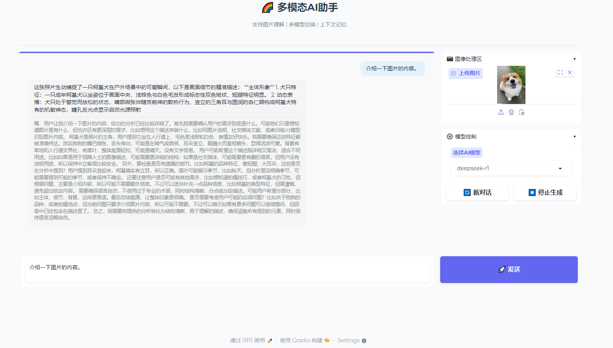

# DeepSeekAPI-Chat —— 支持图片理解

**释放AI的无限潜能！**

你是否对强大的 DeepSeek R1 模型爱不释手，却常常因为官网服务器繁忙而感到沮丧？别担心！现在，你可以通过调用 DeepSeek R1 的 API，在无需排队的情况下畅快体验这一强大模型的魅力。

本项目基于 Gradio 框架搭建了一个简洁易用的聊天界面，不仅支持高效的文本对话，还具备图片理解功能，让你的创意得以尽情释放。此外，阿里云还提供了一定数量的免费 Token，帮助你轻松上手，无需为高昂的成本担忧。

记住：摆脱拥挤服务器的束缚，让灵感与创造力永远在线！

### 功能概览：
- **实时流式交互**：见证AI生成内容的每一步，感受科技的魅力。
- **多模型自由切换**：支持 DeepSeek、Llama 等主流大模型，满足不同场景需求。
- **图片处理能力**：从内容识别到场景解析，让AI“看懂”你的世界。
- **可配置记忆长度**：精准控制对话历史，打造个性化的对话体验。
- **简洁直观界面**：无需复杂操作，上手即用。


## ✨ 核心特性

- 🧠 **实时思考过程可视化**：清晰展示AI的推理与生成过程。
- ⚡ **流式响应交互**：即时反馈，提升用户体验。
- 🔄 **可配置对话轮次记忆**：灵活调整对话历史的记忆长度。
- 🎨 **简洁直观的交互界面**：用户友好，操作便捷。
- 🌐 **多模型支持**：自由选择多种主流大模型，满足不同需求。
- 🖼️ **图片处理能力**：支持图片上传、识别与解析。

## 📸 功能预览

### 1. 实时思考过程
通过流式输出，用户可以实时看到AI的生成过程，增强透明性。

### 2. 多模型切换
支持自由选择不同的大模型，如 DeepSeek、Llama 等，满足多样化的应用场景。

### 3. 图片处理
用户可以通过上传图片，进行内容识别、场景解析等操作，拓展应用范围。

## 🚀 快速启动

### 环境要求
- Python 3.8+
- PIP 包管理工具

### 安装步骤
首先前往 [阿里云](https://account.aliyun.com/) 平台上申请自己的 API-KEY，并将其写入代码中对应的位置。

```bash
# 克隆仓库
git clone https://github.com/xy-adams/deepseekapi.git

# 进入项目目录
cd DeepSeekAPI-Chat

# 安装依赖
pip install -r requirements.txt

## 🛠 使用指南
```

### 1. 启动服务
运行以下命令启动应用程序：

```bash
cd DeepSeekAPI-Chat
python deepseek_api.py
```

默认访问地址为 http://127.0.0.1:7860。

### 2. 切换大模型
在界面中选择需要使用的模型类型，例如：
DeepSeek
Llama
其他支持的模型

### 3. 图片处理
点击“上传图片”按钮，选择本地图片文件，即可实现针对图片的提问的回答。

## 🖼️ 效果展示
